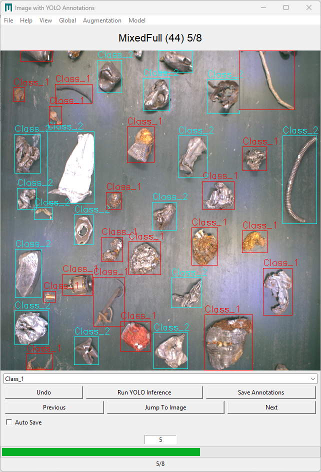

# AVAW CVAT BBox Tool

A lightweight desktop GUI tool for creating, editing, and managing YOLO-style bounding box annotations.
Built with Tkinter, OpenCV, and Ultralytics for fast manual labeling and assisted annotation workflows.

---

## ✨ Features

* 🖼️ Interactive bounding box annotation GUI
* 🔍 Smooth zoom and pan support
* 🧠 Optional YOLO inference for assisted labeling
* 🏷️ Class-based color visualization
* 📂 Image list navigation
* ✏️ Resize, move, copy, and multi-select boxes
* 💾 Auto-save support
* 📊 Confidence display toggle
* 🎨 Custom class names and colors
* 🔄 Annotation translation utilities

---

## 🖥️ Screenshots




---
## Installation

To install the software, download the latest source code from [Releases](https://github.com/AVAWLeoben/AVAW_CVAT/releases) and follow the installation instructions in the [INSTALL](https://github.com/AVAWLeoben/AVAW_CVAT/tree/AVAW_BBOX_DEVELOPMENT/INSTALL) folder.

---

## 🚀 Usage

Run the application:

Compile and run AVAW_CVAT_BBOX_v4.py in your IDE of choice  
or run the AVAW_CVAT_BBOX_v4.py from CLI:  


```bash
python AVAW_CVAT_BBOX_v4.py
```

or, if on Windows (TO DO PACK AS .exe!) run the:  
```
dist/AVAW_CVAT_BBOX_v4.exe  
```

---


## 📁 Project Structure

```
.
├── AVAW_CVAT_BBOX_v4.py
├── annotations_bbox/      # Images and YOLO labels
├── files_bbox/            # Config files, class names, logo
├── settings.json          # Persistent user settings
├── requirements.txt
└── README.md
```

---

## ⚙️ Configuration

### Class Names

Edit:

```
files_bbox/class_names.txt
```

Format:

```
person,car,bicycle,dog
```

---

### Settings

User settings are stored in:

```
settings.json
```

The app automatically saves:

* last image index
* folders
* model path
* UI preferences

---

## 🧠 YOLO Model Support

You can load a YOLO model for automatic predictions.

Supported via:

* Ultralytics YOLO

Adjust in the **Model Settings** window inside the app.

---

## 🖱️ Basic Controls

| Action                    | Binding                                         | Description                                          |
| ------------------------- | ----------------------------------------------- | ---------------------------------------------------- |
| Click (canvas)            | **Left Click**                                  | Select / interact with a box (`on_click`)            |
| Draw / drag               | **Left Click + Drag**                           | Draw or move/resize depending on context (`on_drag`) |
| Finish drag               | **Left Button Release**                         | Finish creation/edit (`on_release`)                  |
| Multi-drag                | **Ctrl + Left Drag**                            | Drag multiple selected boxes (`on_multi_drag`)       |
| Multi-select start        | **Ctrl + Left Click**                           | Start multiselect / add selection (`on_multiselect`) |
| Multi-select stop         | **Ctrl + Right Click**                          | Stop multiselect (`stop_multiselect`)                |
| Context menu              | **Right Click** *(or App/Menu key)*             | Open context menu (`show_context_menu`)              |
| Single-click prediction   | **Alt + Left Click** *(or Ctrl+Alt+Left Click)* | Run prediction at click (`single_click_prediction`)  |
| Add box                   | **n** *(or ↓ Down Arrow)*                       | Add a new box (`add_box`)                            |
| Delete selected box       | **Delete**                                      | Delete selected box (`delete_box`)                   |
| Save                      | **s** *(or ↑ Up Arrow)*                         | Save annotations (`on_save`)                         |
| Force save flag           | **p**                                           | Set save flag (`set_save_flag`)                      |
| Toggle confidences        | **h**                                           | Show/hide confidences (`show_confidences`)           |
| YOLO inference            | **y**                                           | Run YOLO inference (`run_yolo_inference`)            |
| Select all                | **Ctrl + A**                                    | Select all boxes (`select_all`)                      |
| Copy / paste boxes        | **Ctrl + C / Ctrl + V**                         | Copy / paste selection (`on_copy`, `on_paste`)       |
| Next image                | **e / d / → Right Arrow**                       | Next image (`next_image`)                            |
| Previous image            | **q / a / ← Left Arrow**                        | Previous image (`previous_image`)                    |
| Jump to image             | **Enter / Return**                              | Jump to image index (`jump_to_image`)                |
| Translate annotations     | **8 / 2 / 4 / 6**                               | Move all annotations up/down/left/right              |
| Help                      | **F1**                                          | Open help menu                                       |
| Toggle box list           | **F2**                                          | Show/hide box list                                   |
| Toggle image list         | **F3**                                          | Show/hide image list window                          |
| Toggle color selector     | **F4**                                          | Show/hide color selector                             |
| Toggle class names editor | **F5**                                          | Show/hide class names window                         |
| Toggle autosave           | **F6**                                          | Enable/disable autosave                              |
| Screenshot                | **F12**                                         | Take screenshot                                      |


*(TODO KEEP UP TO DATE AND Adjust as actual bindings change during DEV)*

---

## 📋 Requirements

Core dependencies:

* Python ≥ 3.12
* numpy
* pillow
* opencv-python
* natsort
* ultralytics

Install with:

```bash
pip install -r requirements.txt
```

---

## 🛠️ Development

Recommended setup:

```bash
conda env create -f environment.yml
conda activate AVAW_BBOX
```

---

```bash
python -m venv .venv
pip install -U pip
pip install -r requirements.txt
```
More Information in INSTALL/install.txt
---

## ⚠️ Notes

* Tkinter must be available in your Python installation.
* Large Images may require additional RAM.
* Zooming of Large Images may lead to significant performance drops and RAM usage
* GPU acceleration depends on your PyTorch installation and Hardware Setup.

---

## 🐛 Known Limitations

* Limited undo history
* Designed primarily for YOLO bbox workflows

---

## 🤝 Contributing

If you want to contribute, feel free to contact Bojan Lorber via bojan.lorber@unileoben.ac.at.  
Additionally, you can do so by reporting bugs and/or suggesting new feautures.

---

## 📄 License

MIT License

---

## 👤 Author

Gerald Koinig

Technical University of Leoben

Bojan Lorber

Technical University of Leoben

---

## ⭐ Acknowledgements

* OpenCV
* Ultralytics
* Tkinter
* Pillow

---


